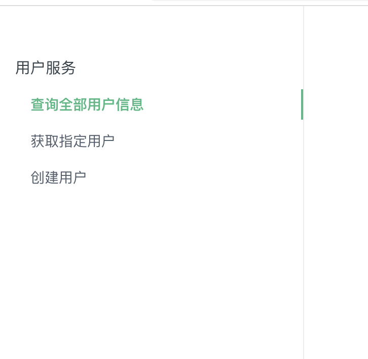
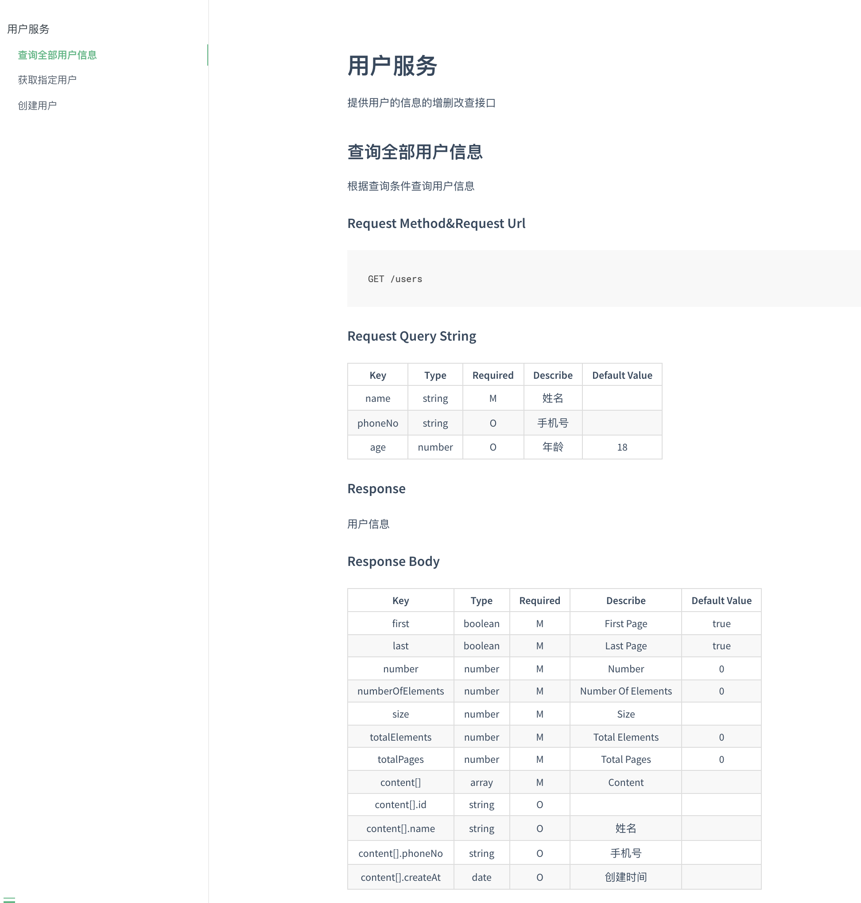
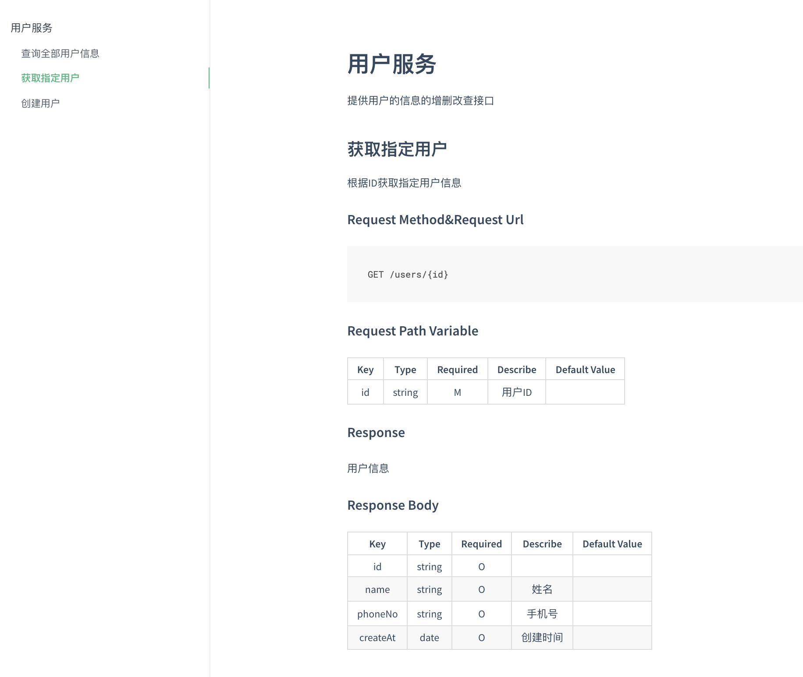
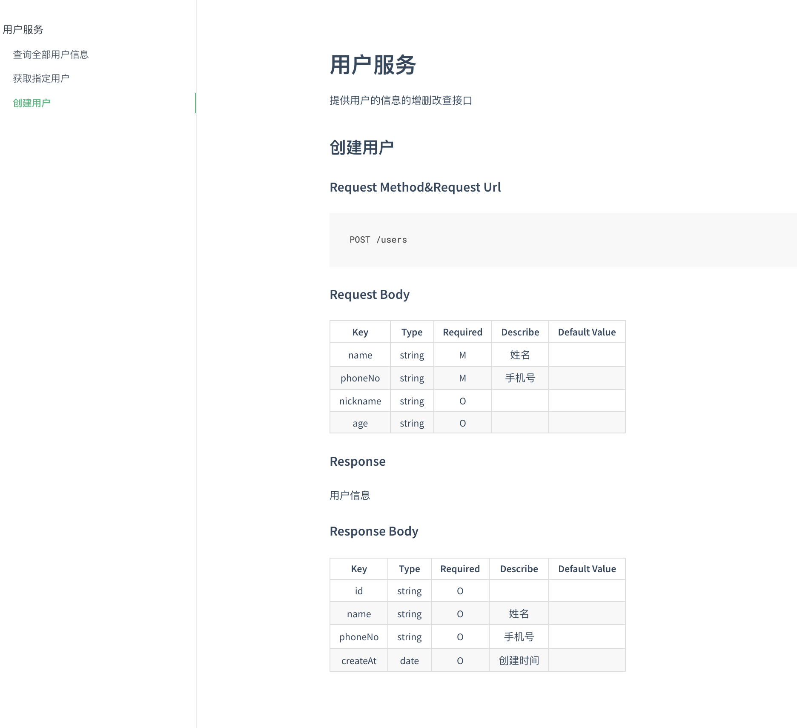

# Java Api Docs

本项目宗旨： 无代码侵入,使用原生javadoc注释生成API接口文档。

[立即为您的项目生成API文档](https://aomi-java.github.io/apidocs)

```java
import org.junit.Test;
import tech.aomi.apidocs.DocsOptions;
import tech.aomi.apidocs.SpringMvcApiDocs;
import tech.aomi.apidocs.plugins.DocsifyBuilderPlugin;
import tech.aomi.apidocs.plugins.MarkdownBuilderPlugin;

public class DocsTest {

    @Test
    public void generate() {
        new SpringMvcApiDocs(new DocsOptions.Builder()
                .srcPath("src/main/java") // 源代码路径
                .docsPath("apidocs") // 生成的文档目录
                .builderPlugin(new MarkdownBuilderPlugin()) // 生成 Markdown 文件
                .builderPlugin(new DocsifyBuilderPlugin()) // 生成Docsify 文档网站
                .build()
        ).generate();

    }
}
```

### 文档生成效果

代码如下: 
```java
package tech.aomi.apidocs.demo;

import org.springframework.data.domain.Page;
import org.springframework.web.bind.annotation.*;
import tech.aomi.apidocs.demo.entity.User;
import tech.aomi.apidocs.demo.form.CreateUserForm;

import javax.validation.Valid;

/**
 * 用户服务
 * 提供用户的信息的增删改查接口
 *
 * @author Sean createAt 2021/8/26
 */
@RestController
@RequestMapping("/users")
public class UserController {


    /**
     * 查询全部用户信息
     * 根据查询条件查询用户信息
     *
     * @param name    姓名
     * @param phoneNo 手机号
     * @param age     年龄
     * @return 用户信息 {@link org.springframework.data.domain.Page} {@link User}
     */
    @GetMapping
    public Page<User> showAll(@RequestParam String name, String phoneNo, @RequestParam(defaultValue = "18") Integer age) {
        return null;
    }

    /**
     * 获取指定用户
     * 根据ID获取指定用户信息
     *
     * @param id 用户ID
     * @return 用户信息 {@link User}
     */
    @GetMapping("/{id}")
    public User findOne(@PathVariable String id) {
        return null;
    }

    /**
     * 创建用户
     *
     * @param form 用户表单
     * @return 用户信息 {@link User}
     */
    @PostMapping
    public User create(@RequestBody @Valid CreateUserForm form) {
        return null;
    }
}
```
效果图:

* 菜单导航

    
  
* 查询接口

    
  
* 路径带参数接口

    
  
* 参数为请求体

    